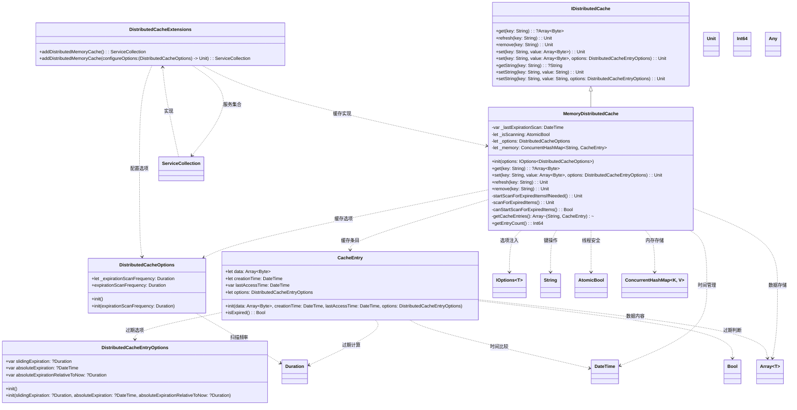
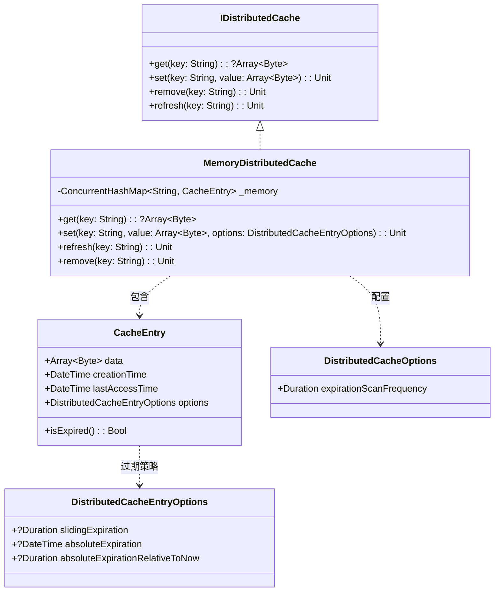
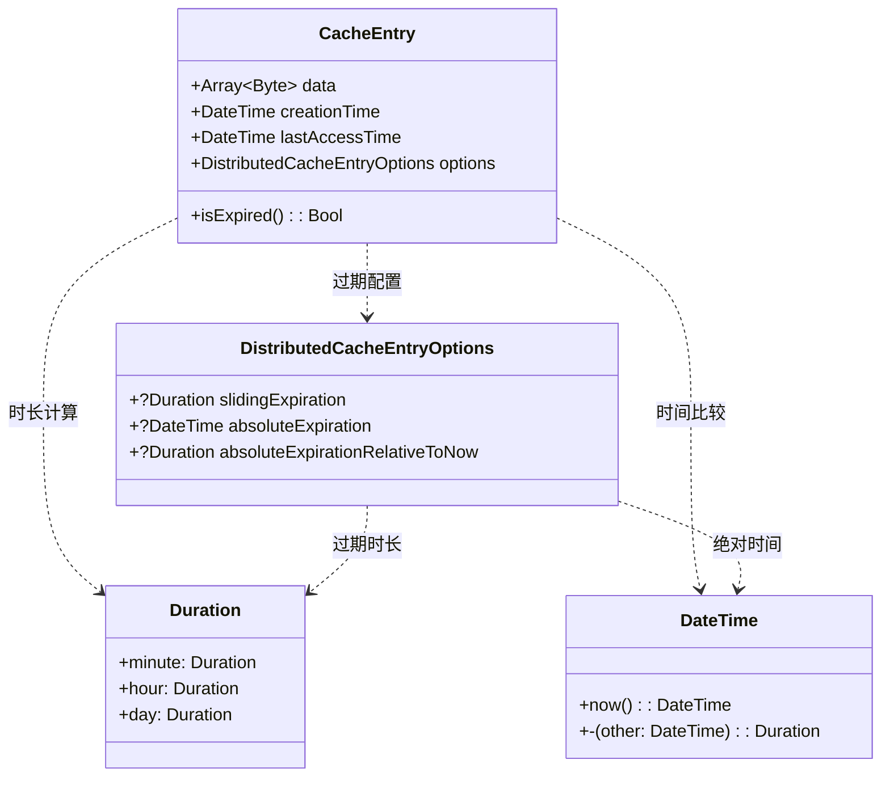

# spire_extensions_caching

## 项目概述
Spire Extensions Caching 是一个功能完整的分布式缓存系统，基于 Cangjie 语言实现，提供了灵活的内存缓存管理，支持多种过期策略和依赖注入集成。

## UML类图

## 核心组件说明

### 1. 缓存接口和实现
- **IDistributedCache**: 分布式缓存核心接口，定义基本的缓存操作
- **MemoryDistributedCache**: 内存分布式缓存实现，支持过期策略和自动清理

### 2. 缓存条目和选项
- **CacheEntry**: 缓存条目类，包含数据、时间戳和过期策略
- **DistributedCacheEntryOptions**: 缓存条目选项，支持滑动过期、绝对过期等策略
- **DistributedCacheOptions**: 缓存全局选项，配置扫描频率等参数

### 3. 依赖注入扩展
- **DistributedCacheExtensions**: 依赖注入扩展类，提供缓存服务注册

### 4. 过期策略
- **滑动过期**: 每次访问后延长过期时间
- **绝对过期**: 固定时间点过期
- **相对过期**: 相对于创建时间的过期

## 设计特点

1. **分布式设计**: 基于接口的设计，支持多种缓存实现
2. **过期策略**: 支持多种过期策略，满足不同场景需求
3. **自动清理**: 后台自动扫描和清理过期项
4. **线程安全**: 使用并发集合和原子操作，支持多线程环境
5. **依赖注入**: 与依赖注入容器深度集成
6. **类型安全**: 提供字符串和字节数组的便捷方法
7. **性能优化**: 使用内存缓存，访问速度快
8. **可扩展性**: 通过接口支持自定义缓存实现

## 使用场景

- 应用程序缓存
- 会话状态存储
- 数据库查询结果缓存
- API响应缓存
- 分布式锁和计数器
- 临时数据存储

## 精简版UML类图

## 过期策略UML类图

### 过期策略说明

**滑动过期 (Sliding Expiration)**:
- 每次访问后重新计算过期时间
- 适用于活跃数据保持缓存

**绝对过期 (Absolute Expiration)**:
- 固定时间点过期
- 适用于定时更新的数据

**相对过期 (Relative Expiration)**:
- 相对于创建时间的过期
- 适用于有固定生命周期的数据

## 核心类关系说明

**核心接口**：
- **IDistributedCache**: 分布式缓存接口

**核心实现**：
- **MemoryDistributedCache**: 内存缓存实现
- **CacheEntry**: 缓存条目

**配置类**：
- **DistributedCacheOptions**: 缓存全局配置
- **DistributedCacheEntryOptions**: 缓存条目配置

**扩展类**：
- **DistributedCacheExtensions**: 依赖注入扩展

**支持类**：
- **DateTime**: 时间处理
- **Duration**: 时长处理
- **ConcurrentHashMap**: 并发哈希表
- **AtomicBool**: 原子布尔值