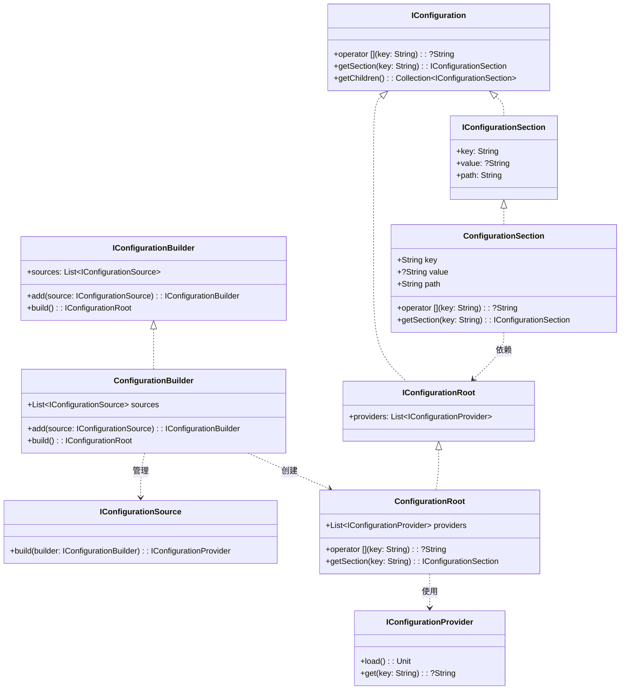
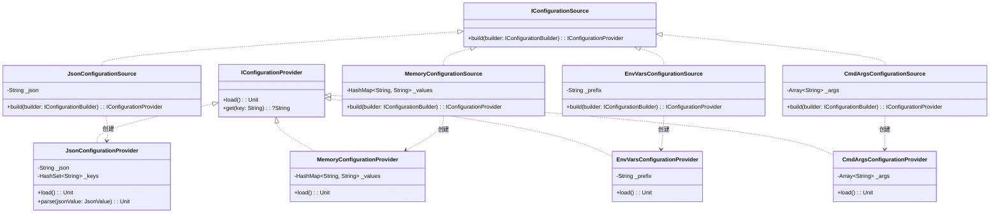

# spire_extensions_configuration

## 概述
Spire Extensions Configuration 是一个功能完整的配置系统，基于 Cangjie 语言实现，提供了灵活的配置管理功能，支持多种配置源（JSON、环境变量、命令行参数、内存配置等）和层次化配置结构。

## UML类图

```mermaid
classDiagram
    class IConfiguration {
        +operator [](name: String): ?String
        +operator [](name: String, value!: ?String): Unit
        +getSection(name: String): IConfigurationSection
        +getChildren(): Collection~IConfigurationSection~
        +getValue(typeInfo: TypeInfo, name: String): ?Any
        +getValue~T~(name: String): ?T
        +bind(name: String, instance: Object): Unit
    }
    
    class IConfigurationRoot {
        +providers: List~IConfigurationProvider~
    }
    
    class IConfigurationSection {
        +key: String
        +value: ?String
        +path: String
    }
    
    class IConfigurationBuilder {
        +sources: List~IConfigurationSource~
        +properties: Map~String, Any~
        +add(source: IConfigurationSource): IConfigurationBuilder
        +build(): IConfigurationRoot
    }
    
    class IConfigurationSource {
        +build(builder: IConfigurationBuilder): IConfigurationProvider
    }
    
    class IConfigurationProvider {
        +load(): Unit
        +get(key: String): ?String
        +set(key: String, value: ?String): Unit
        +getChildKeys(earlierKeys: Iterable~String~, parentPath: ?String): Iterable~String~
    }
    
    class ConfigurationRoot {
        -List~IConfigurationProvider~ _providers
        +init(providers: List~IConfigurationProvider~)
        +providers: List~IConfigurationProvider~
        +operator [](key: String): ?String
        +operator [](key: String, value!: ?String): Unit
        +getSection(key: String): IConfigurationSection
        +getChildren(): Collection~IConfigurationSection~
        +static getConfiguration(providers: List~IConfigurationProvider~, key: String): ?String
        +static setConfiguration(providers: Collection~IConfigurationProvider~, key: String, value: ?String): ?String
    }
    
    class ConfigurationSection {
        -String _path
        -String _key
        -?String _value
        -IConfigurationRoot _root
        +init(path: String, key: String, value: ?String, root: IConfigurationRoot)
        +key: String
        +value: ?String
        +path: String
        +operator [](key: String): ?String
        +operator [](key: String, value!: ?String): Unit
        +getSection(key: String): IConfigurationSection
        +getChildren(): Collection~IConfigurationSection~
    }
    
    class ConfigurationBuilder {
        -HashMap~String, Any~ _properties
        -ArrayList~IConfigurationSource~ _sources
        -ArrayList~IConfigurationProvider~ _providers
        +sources: List~IConfigurationSource~
        +properties: Map~String, Any~
        +add(source: IConfigurationSource): IConfigurationBuilder
        +build(): IConfigurationRoot
    }
    
    class ConfigurationManager {
        -ArrayList~IConfigurationSource~ _sources
        -HashMap~String, Any~ _properties
        -ArrayList~IConfigurationProvider~ _providers
        +sources: List~IConfigurationSource~
        +providers: List~IConfigurationProvider~
        +properties: Map~String, Any~
        +operator [](key: String): ?String
        +operator [](key: String, value!: ?String): Unit
        +getSection(key: String): IConfigurationSection
        +getChildren(): Collection~IConfigurationSection~
        +add(source: IConfigurationSource): IConfigurationBuilder
        +build(): IConfigurationRoot
    }
    
    class ConfigurationProvider {
        -HashMap~String, ?String~ _data
        +data: HashMap~String, ?String~
        +get(key: String): ?String
        +set(key: String, value: ?String): Unit
        +getChildKeys(earlierKeys: Iterable~String~, parentPath: ?String): Iterable~String~
        +load(): Unit
    }
    
    class JsonConfigurationProvider {
        -String _json
        -HashSet~String~ _keys
        +init(json: String)
        +parse(jsonValue: JsonValue): Unit
        +parseObject(jsonObject: JsonObject): Unit
        +parseArray(jsonArray: JsonArray): Unit
        +parseValue(jsonValue: JsonValue): Unit
        +addValue(value: String): Unit
        +load(): Unit
    }
    
    class JsonConfigurationSource {
        -String _json
        +init(json: String)
        +build(builder: IConfigurationBuilder): IConfigurationProvider
    }
    
    class MemoryConfigurationProvider {
        -HashMap~String, String~ _values
        +init(values: HashMap~String, String~)
        +load(): Unit
    }
    
    class MemoryConfigurationSource {
        -HashMap~String, String~ _values
        +init(values: HashMap~String, String~)
        +build(builder: IConfigurationBuilder): IConfigurationProvider
    }
    
    class EnvVarsConfigurationProvider {
        -String _prefix
        +init(prefix: String)
        +load(): Unit
    }
    
    class EnvVarsConfigurationSource {
        -String _prefix
        +init(prefix: String)
        +build(builder: IConfigurationBuilder): IConfigurationProvider
    }
    
    class CmdArgsConfigurationProvider {
        -Array~String~ _args
        +init(args: Array~String~)
        +load(): Unit
    }
    
    class CmdArgsConfigurationSource {
        -Array~String~ _args
        +init(args: Array~String~)
        +build(builder: IConfigurationBuilder): IConfigurationProvider
    }
    
    class String {
    }
    
    class Unit {
    }
    
    class Bool {
    }
    
    class Int32 {
    }
    
    class Int64 {
    }
    
    class UInt32 {
    }
    
    class UInt64 {
    }
    
    class Float32 {
    }
    
    class Float64 {
    }
    
    class Rune {
    }
    
    class Array~T~ {
    }
    
    class Collection~T~ {
    }
    
    class List~T~ {
    }
    
    class Map~K, V~ {
    }
    
    class HashMap~K, V~ {
    }
    
    class ArrayList~T~ {
    }
    
    class HashSet~T~ {
    }
    
    class Iterable~T~ {
    }
    
    class TypeInfo {
    }
    
    class ClassTypeInfo {
    }
    
    class Object {
    }
    
    class Any {
    }
    
    class JsonValue {
    }
    
    class JsonObject {
    }
    
    class JsonArray {
    }
    
    class JsonKind {
    }
    
    class IOStream {
    }
    
    class File {
    }
    
    class OpenMode {
    }
    
    %% 继承关系
    IConfiguration <|-- IConfigurationRoot
    IConfiguration <|-- IConfigurationSection
    IConfigurationRoot <|-- ConfigurationRoot
    IConfigurationRoot <|-- ConfigurationManager
    IConfigurationSection <|-- ConfigurationSection
    IConfigurationBuilder <|-- ConfigurationBuilder
    IConfigurationBuilder <|-- ConfigurationManager
    IConfigurationSource <|-- JsonConfigurationSource
    IConfigurationSource <|-- MemoryConfigurationSource
    IConfigurationSource <|-- EnvVarsConfigurationSource
    IConfigurationSource <|-- CmdArgsConfigurationSource
    IConfigurationProvider <|-- ConfigurationProvider
    IConfigurationProvider <|-- JsonConfigurationProvider
    IConfigurationProvider <|-- MemoryConfigurationProvider
    IConfigurationProvider <|-- EnvVarsConfigurationProvider
    IConfigurationProvider <|-- CmdArgsConfigurationProvider
    
    %% 实现关系
    ConfigurationRoot ..> IConfigurationRoot : 实现
    ConfigurationSection ..> IConfigurationSection : 实现
    ConfigurationBuilder ..> IConfigurationBuilder : 实现
    ConfigurationManager ..> IConfigurationRoot : 实现
    ConfigurationManager ..> IConfigurationBuilder : 实现
    JsonConfigurationProvider ..> IConfigurationProvider : 实现
    MemoryConfigurationProvider ..> IConfigurationProvider : 实现
    EnvVarsConfigurationProvider ..> IConfigurationProvider : 实现
    CmdArgsConfigurationProvider ..> IConfigurationProvider : 实现
    
    %% 依赖关系
    ConfigurationRoot ..> IConfigurationProvider : 提供者集合
    ConfigurationRoot ..> String : 键值操作
    ConfigurationRoot ..> ConfigurationSection : 创建节
    ConfigurationSection ..> IConfigurationRoot : 根配置
    ConfigurationSection ..> String : 路径和键
    ConfigurationBuilder ..> IConfigurationSource : 源集合
    ConfigurationBuilder ..> IConfigurationProvider : 提供者集合
    ConfigurationBuilder ..> ConfigurationRoot : 创建
    ConfigurationManager ..> IConfigurationSource : 源管理
    ConfigurationManager ..> IConfigurationProvider : 提供者管理
    ConfigurationProvider ..> HashMap~String, ?String~ : 数据存储
    ConfigurationProvider ..> String : 键值操作
    JsonConfigurationProvider ..> JsonValue : JSON解析
    JsonConfigurationProvider ..> JsonObject : 对象解析
    JsonConfigurationProvider ..> JsonArray : 数组解析
    JsonConfigurationProvider ..> HashSet~String~ : 键管理
    JsonConfigurationSource ..> JsonConfigurationProvider : 创建提供者
    JsonConfigurationSource ..> String : JSON字符串
    MemoryConfigurationProvider ..> HashMap~String, String~ : 内存值
    MemoryConfigurationSource ..> MemoryConfigurationProvider : 创建提供者
    EnvVarsConfigurationProvider ..> String : 环境变量前缀
    EnvVarsConfigurationSource ..> EnvVarsConfigurationProvider : 创建提供者
    CmdArgsConfigurationProvider ..> Array~String~ : 命令行参数
    CmdArgsConfigurationSource ..> CmdArgsConfigurationProvider : 创建提供者
    
    %% 扩展关系
    ConfigurationManager ..> JsonConfigurationSource : 添加JSON源
    ConfigurationManager ..> MemoryConfigurationSource : 添加内存源
    ConfigurationManager ..> EnvVarsConfigurationSource : 添加环境变量源
    ConfigurationManager ..> CmdArgsConfigurationSource : 添加命令行源
```

## 核心组件说明

### 1. 核心接口
- **IConfiguration**: 基础配置接口，定义配置访问和操作
- **IConfigurationRoot**: 配置根接口，提供配置提供者访问
- **IConfigurationSection**: 配置节接口，表示配置的子节点
- **IConfigurationBuilder**: 配置构建器接口，用于构建配置系统
- **IConfigurationSource**: 配置源接口，定义配置数据源
- **IConfigurationProvider**: 配置提供者接口，负责加载和提供配置数据

### 2. 核心实现
- **ConfigurationRoot**: 配置根实现，管理多个配置提供者
- **ConfigurationSection**: 配置节实现，支持层次化配置
- **ConfigurationBuilder**: 配置构建器实现
- **ConfigurationManager**: 配置管理器，集成了构建器和根配置功能
- **ConfigurationProvider**: 抽象配置提供者基类

### 3. 配置源实现
- **JsonConfigurationSource**: JSON配置源
- **MemoryConfigurationSource**: 内存配置源
- **EnvVarsConfigurationSource**: 环境变量配置源
- **CmdArgsConfigurationSource**: 命令行参数配置源

### 4. 配置提供者实现
- **JsonConfigurationProvider**: JSON配置提供者
- **MemoryConfigurationProvider**: 内存配置提供者
- **EnvVarsConfigurationProvider**: 环境变量配置提供者
- **CmdArgsConfigurationProvider**: 命令行参数配置提供者

## 设计特点

1. **层次化配置**: 支持配置节和子节的层次化结构
2. **多源支持**: 支持JSON、环境变量、命令行参数、内存等多种配置源
3. **优先级机制**: 后添加的配置源优先级更高
4. **类型转换**: 支持自动类型转换和绑定
5. **灵活扩展**: 通过接口设计支持自定义配置源和提供者
6. **链式调用**: 配置构建器支持链式调用
7. **内存效率**: 使用哈希表存储配置数据，访问效率高
8. **线程安全**: 配置数据加载后为只读，支持多线程访问

## 使用场景

- 应用程序配置管理
- 多环境配置（开发、测试、生产）
- 微服务配置
- 库和框架配置
- 用户偏好设置
- 功能开关配置
- 连接字符串和API密钥管理

## 精简版UML类图

## 配置源UML类图

### 配置源说明

**JSON配置源**：
- 从JSON字符串或文件加载配置
- 支持嵌套对象和数组
- 自动转换为扁平键值对

**内存配置源**：
- 从内存中的键值对加载配置
- 适用于程序化配置
- 支持动态配置更新

**环境变量配置源**：
- 从系统环境变量加载配置
- 支持前缀过滤和命名转换
- 适用于容器化和部署环境

**命令行参数配置源**：
- 从命令行参数加载配置
- 支持 `key=value` 格式
- 适用于命令行工具和脚本

## 核心类关系说明

**核心接口**：
- **IConfiguration**: 配置访问接口
- **IConfigurationRoot**: 配置根接口
- **IConfigurationSection**: 配置节接口
- **IConfigurationBuilder**: 配置构建器接口
- **IConfigurationSource**: 配置源接口
- **IConfigurationProvider**: 配置提供者接口

**核心实现**：
- **ConfigurationRoot**: 配置根实现
- **ConfigurationSection**: 配置节实现
- **ConfigurationBuilder**: 配置构建器实现
- **ConfigurationManager**: 配置管理器实现
- **ConfigurationProvider**: 配置提供者基类

**配置源**：
- **JsonConfigurationSource**: JSON配置源
- **MemoryConfigurationSource**: 内存配置源
- **EnvVarsConfigurationSource**: 环境变量配置源
- **CmdArgsConfigurationSource**: 命令行配置源

**支持类**：
- **JsonValue**: JSON值处理
- **HashMap**: 哈希表存储
- **ArrayList**: 动态数组
- **HashSet**: 哈希集合