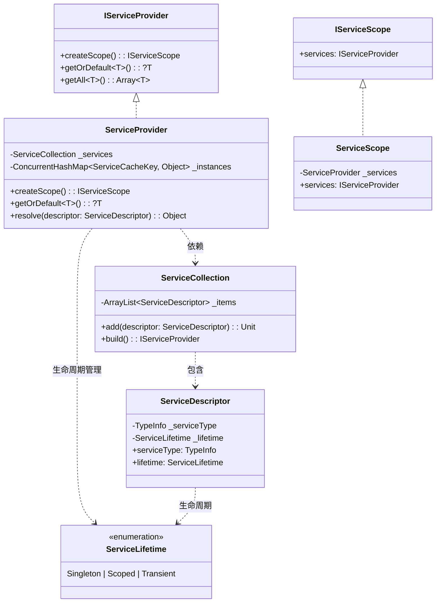

# spire_extensions_injection
依赖注入（DI）框架，用于管理应用程序中的 依赖对象的创建和生命周期。提供了模块化、可扩展的方式来管理组件依赖。

## 生命周期

| 周期                                               | 说明                                                     |
|---------------------------------------------------|----------------------------------------------------------|
| **Singleton**                                     | 单例：一个根容器及其子容器，只创建一个实列                   |
| **Scoped**                                        | 作用域：同一个作用域只创建一个实列，生命周期由业务定义        |
| **Transient**                                     | 瞬时：每次解析都是一个新的实列                              |

## 服务注册

``` cangjie
//创建服务描述集合
let services = ServiceCollection()

//1. 注册单列
services.addSingleton(DbContext())

//2. 服务类型和实现类型
services.addSingleton<IDbConnection, MySqlConnection>()

//3. 尝试注册，如果IDbConnection服务已注册将不在注册
services.tryAddSingleton<IDbConnection, MySqlConnection>()

//4. 通过工厂模式注册：该方式性能最佳，可以规避反射
services.addSingleton<DbContext, DbContext>{ sp => 
    let connection = sp.getOrThrow<IDbConnection>()
    return DbContext(connection)
}

//5. 如果DbContext依赖项很多可以通过ActivatorUtilities来注册
services.addSingleton<DbContext, DbContext>{ sp => 
    return ActivatorUtilities.createInstance<DbContext>(sp)
}

//6. 通过TypeInfo的方式注册
services.addSingleton(TypeInfo.of<DbContext>(), TypeInfo.of<DbContext>())
```

> 由于cangjie不支持泛型重载导致必须指定服务类型和实现类型，你可以通过`扩展+新名称`的方式来规避    
>  `Singleton`改成`Scoped`或`Transient`可以注册不同的生命周期

## 服务解析

* 解析服务自身

``` cangjie
let services = ServiceCollection()

//构建服务提供程序
let provider = services.build()

//解析服务自身
let providerSelf = provder.getOrThrow<IServiceProvider>()
``` 

* 解析多实现

``` cangjie
let services = ServiceCollection()
services.addSingleton<IDbConnection, MsSqlConnection>()
services.addSingleton<IDbConnection, MySqlConnection>()
//构建服务提供程序
let provider = services.build()
//解析IDbConnection注册的所有实现
let connections = provder.getAll<IDbConnection>()
``` 

* 创建作用域

``` cangjie
let services = ServiceCollection()
services.addScoped<IDbConnection, MsSqlConnection>()
//构建服务提供程序
let provider = services.build()
try(scope = provider.createScope()) {
    let connection = scope.services.getOrThrow<IDbConnection>()
}
```
> try语句块执行结束，将释放由该作用域解析的所有非单例的服务    
> 如果服务实现了`Resouce`接口，那么将执行该服务的close方法

## UML类图

```mermaid
classDiagram
    class IServiceProvider {
        +createScope(): IServiceScope
        +getAll~T~(): Array~T~
        +getOrDefault(typeInfo: TypeInfo): ?Object
        +getOrDefault~T~(): ?T
        +getOrThrow(typeInfo: TypeInfo): Object
        +getOrThrow~T~(): T
    }
    
    class ServiceProvider {
        -Bool _isClosed
        -?ServiceProvider _root
        -ServiceCollection _services
        -ServiceProviderOptions _options
        -ConcurrentLinkedQueue~Resource~ _resources
        -ConcurrentHashMap~ServiceCacheKey, Object~ _instances
        +init(services: ServiceCollection, options: ServiceProviderOptions, root!: ?ServiceProvider)
        +createScope(): IServiceScope
        +getOrDefault(serviceType: TypeInfo): ?Object
        +getAll~T~(): Array~T~
        +resolve(descriptor: ServiceDescriptor, engine: IServiceProvider, slot!: Int64): Object
        +isClosed(): Bool
        +close(): Unit
        +services: ServiceCollection
        +resources: Collection~Resource~
        +isRoot: Bool
    }
    
    class ServiceProviderEngine {
        -ServiceProvider _provider
        -ServiceCallChain _chain
        +init(provider: ServiceProvider)
        +createScope(): IServiceScope
        +getOrDefault(serviceType: TypeInfo): ?Object
        +getAll~T~(): Array~T~
    }
    
    class IServiceScope {
        +services: IServiceProvider
        +isClosed(): Bool
        +close(): Unit
    }
    
    class ServiceScope {
        -Bool _isClosed
        -ServiceProvider _services
        +init(services: ServiceProvider)
        +services: IServiceProvider
        +isClosed(): Bool
        +close(): Unit
    }
    
    class ServiceCollection {
        -Bool _isReadOnly
        -ArrayList~ServiceDescriptor~ _items
        +add(element: ServiceDescriptor): Unit
        +tryAdd(element: ServiceDescriptor): Unit
        +add(all!: Collection~ServiceDescriptor~): Unit
        +add(element: ServiceDescriptor, at!: Int64): Unit
        +add(all!: Collection~ServiceDescriptor~, at!: Int64): Unit
        +remove(at!: Int64): Unit
        +remove(range: Range~Int64~): Unit
        +removeIf(predicate: (ServiceDescriptor) -> Bool): Unit
        +clear(): Unit
        +findLast(serviceType: TypeInfo): ?ServiceDescriptor
        +findAll(serviceType: TypeInfo): Array~ServiceDescriptor~
        +build(): IServiceProvider
        +build(configureOptions: (ServiceProviderOptions) -> Unit): IServiceProvider
    }
    
    class ServiceDescriptor {
        -TypeInfo _serviceType
        -?TypeInfo _implementationType
        -?Object _implementationInstance
        -?(IServiceProvider) -> Object _implementationFactory
        -ServiceLifetime _lifetime
        +init(serviceType: TypeInfo, instance: Any)
        +init(serviceType: TypeInfo, factory: (IServiceProvider) -> Object, lifetime: ServiceLifetime)
        +init(serviceType: TypeInfo, implementationType: TypeInfo, lifetime: ServiceLifetime)
        +serviceType: TypeInfo
        +implementationType: ?TypeInfo
        +implementationInstance: ?Object
        +implementationFactory: ?(IServiceProvider) -> Object
        +lifetime: ServiceLifetime
        +static singleton~TServiceType~(instance: TServiceType): ServiceDescriptor
        +static singleton~TServiceType, TImplementationType~(): ServiceDescriptor
        +static scoped~TServiceType, TImplementationType~(): ServiceDescriptor
        +static transient~TServiceType, TImplementationType~(): ServiceDescriptor
    }
    
    class ServiceLifetime {
        <<enumeration>>
        Singleton | Scoped | Transient
        +isScoped(): Bool
        +isTransient(): Bool
        +isSingleton(): Bool
        +toString(): String
    }
    
    class ServiceCacheKey {
        -Int64 _slot
        -ServiceIdentifier _identifier
        +init(identifier: ServiceIdentifier, slot: Int64)
        +==(rhs: ServiceCacheKey): Bool
        +hashCode(): Int64
    }
    
    class ServiceIdentifier {
        -TypeInfo _serviceType
        +init(serviceType: TypeInfo)
        +serviceType: TypeInfo
        +static fromServiceType(serviceType: TypeInfo): ServiceIdentifier
        +static fromDescriptor(descriptor: ServiceDescriptor): ServiceIdentifier
        +==(oth: ServiceIdentifier): Bool
        +hashCode(): Int64
        +toString(): String
    }
    
    class ServiceCallChain {
        -HashSet~ServiceIdentifier~ _items
        +checkLoopDependency(identifier: ServiceIdentifier): Unit
        +add(identifier: ServiceIdentifier): Unit
    }
    
    class ServiceProviderOptions {
        +Bool validateScopes
        +Bool validateLoopDependency
    }
    
    class ActivatorUtilities {
        +static createInstance~T~(serviceProvider: IServiceProvider, args: Array~Any~): T
        +static createInstance(serviceProvider: IServiceProvider, typeInfo: TypeInfo, args: Array~Any~): Object
    }
    
    class ServiceCollectionExtensions {
        +addSingleton~TService~(instance: TService): ServiceCollection
        +addSingleton~TService, TImplementation~(): ServiceCollection
        +addSingleton~TService, TImplementation~(sp: (IServiceProvider) -> TImplementation): ServiceCollection
        +addScoped~TService, TImplementation~(): ServiceCollection
        +addScoped~TService, TImplementation~(sp: (IServiceProvider) -> TImplementation): ServiceCollection
        +addTransient~TService, TImplementation~(): ServiceCollection
        +addTransient~TService, TImplementation~(sp: (IServiceProvider) -> TImplementation): ServiceCollection
        +tryAddSingleton~TService, TImplementation~(): ServiceCollection
        +tryAddScoped~TService, TImplementation~(): ServiceCollection
        +tryAddTransient~TService, TImplementation~(): ServiceCollection
        +tryAddEnumerable(descriptor: ServiceDescriptor): ServiceCollection
    }
    
    class Resource {
        +isClosed(): Bool
        +close(): Unit
    }
    
    class List~T~ {
    }
    
    class ArrayList~T~ {
    }
    
    class ConcurrentHashMap~K, V~ {
    }
    
    class ConcurrentLinkedQueue~T~ {
    }
    
    class HashSet~T~ {
    }
    
    class TypeInfo {
    }
    
    class ConstructorInfo {
    }
    
    class Exception {
    }
    
    class Object {
    }
    
    class Array~T~ {
    }
    
    class Collection~T~ {
    }
    
    class Range~T~ {
    }
    
    class String {
    }
    
    class Bool {
    }
    
    class Int64 {
    }
    
    class Unit {
    }
    
    class Any {
    }
    
    %% 继承关系
    IServiceProvider <|-- ServiceProvider
    IServiceProvider <|-- ServiceProviderEngine
    IServiceScope <|-- ServiceScope
    ServiceCollection <|-- List~ServiceDescriptor~
    ServiceCacheKey <|-- Hashable
    ServiceCacheKey <|-- Equatable~ServiceCacheKey~
    ServiceIdentifier <|-- Hashable
    ServiceIdentifier <|-- Equatable~ServiceIdentifier~
    ServiceIdentifier <|-- ToString
    ServiceLifetime <|-- ToString
    ServiceProvider <|-- Resource
    
    %% 依赖关系
    ServiceProvider ..> ServiceCollection : 包含服务描述符
    ServiceProvider ..> ServiceProviderOptions : 配置选项
    ServiceProvider ..> ConcurrentLinkedQueue~Resource~ : 资源管理
    ServiceProvider ..> ConcurrentHashMap~ServiceCacheKey, Object~ : 实例缓存
    ServiceProvider ..> ServiceCacheKey : 缓存键
    ServiceProvider ..> ServiceIdentifier : 服务标识
    ServiceProvider ..> ActivatorUtilities : 实例创建
    ServiceProvider ..> Exception : 异常处理
    ServiceProviderEngine ..> ServiceProvider : 包装器
    ServiceProviderEngine ..> ServiceCallChain : 循环依赖检测
    ServiceScope ..> ServiceProvider : 服务提供者
    ServiceScope ..> Resource : 资源管理
    ServiceCollection ..> ArrayList~ServiceDescriptor~ : 内部存储
    ServiceCollection ..> ServiceProvider : 创建服务提供者
    ServiceCollection ..> ServiceProviderOptions : 配置选项
    ServiceCollection ..> Exception : 异常处理
    ServiceDescriptor ..> TypeInfo : 类型信息
    ServiceDescriptor ..> ServiceLifetime : 生命周期
    ServiceDescriptor ..> Object : 实例对象
    ServiceDescriptor ..> Exception : 异常处理
    ServiceCacheKey ..> ServiceIdentifier : 服务标识
    ServiceCacheKey ..> Int64 : 插槽位置
    ServiceIdentifier ..> TypeInfo : 服务类型
    ServiceCallChain ..> HashSet~ServiceIdentifier~ : 依赖路径
    ServiceCallChain ..> StringBuilder : 路径构建
    ServiceCallChain ..> Exception : 异常处理
    ActivatorUtilities ..> ConstructorInfo : 构造器信息
    ActivatorUtilities ..> TypeInfo : 类型信息
    ActivatorUtilities ..> ArrayList~Any~ : 参数列表
    ActivatorUtilities ..> Exception : 异常处理
    ServiceCollectionExtensions ..> ServiceCollection : 扩展方法
    ServiceCollectionExtensions ..> ServiceDescriptor : 创建服务描述符
    
    %% 接口实现关系
    ServiceProvider ..> IServiceProvider : 实现
    ServiceProviderEngine ..> IServiceProvider : 实现
    ServiceScope ..> IServiceScope : 实现
    ServiceProvider ..> Resource : 实现
```



## 核心组件说明

### 1. 服务提供者接口
- **IServiceProvider**: 核心服务提供者接口，定义服务解析的基本操作
- **ServiceProvider**: 默认服务提供者实现，支持生命周期管理和资源释放
- **ServiceProviderEngine**: 服务提供者引擎，支持循环依赖检测

### 2. 服务生命周期
- **ServiceLifetime**: 服务生命周期枚举，定义 Singleton、Scoped、Transient 三种生命周期
- **IServiceScope**: 服务作用域接口，用于管理 Scoped 生命周期服务
- **ServiceScope**: 服务作用域实现，负责资源的创建和释放

### 3. 服务注册和描述
- **ServiceCollection**: 服务集合，用于注册和管理服务描述符
- **ServiceDescriptor**: 服务描述符，包含服务的类型信息、实现方式和生命周期
- **ServiceCollectionExtensions**: 服务集合扩展，提供便捷的服务注册方法

### 4. 缓存和标识
- **ServiceCacheKey**: 服务缓存键，用于标识和缓存服务实例
- **ServiceIdentifier**: 服务标识符，唯一标识一个服务类型
- **ConcurrentHashMap**: 并发哈希表，用于缓存服务实例

### 5. 依赖注入工具
- **ActivatorUtilities**: 激活工具类，用于创建服务实例
- **ServiceCallChain**: 服务调用链，用于检测循环依赖
- **ServiceProviderOptions**: 服务提供者选项，配置容器行为

### 6. 资源管理
- **Resource**: 资源接口，定义资源释放行为
- **ConcurrentLinkedQueue**: 并发队列，用于管理需要释放的资源

## 设计特点

1. **生命周期管理**: 支持 Singleton、Scoped、Transient 三种服务生命周期
2. **线程安全**: 关键组件使用并发集合，支持多线程访问
3. **循环依赖检测**: 通过 ServiceCallChain 检测和防止循环依赖
4. **资源管理**: 自动管理服务的生命周期和资源释放
5. **灵活注册**: 支持类型、实例、工厂函数等多种注册方式
6. **作用域支持**: 支持创建子作用域，隔离 Scoped 服务
7. **泛型支持**: 提供类型安全的泛型接口和方法
8. **扩展性**: 通过扩展方法提供便捷的 API

## 使用场景

- 应用程序依赖注入
- 模块化服务注册
- 生命周期管理
- 资源自动释放
- 循环依赖检测
- 多线程环境下的服务解析
- 配置化的服务容器

## 精简版UML类图



## 核心类关系说明

**核心接口**：
- **IServiceProvider**: 服务提供者接口，定义服务解析的基本操作
- **IServiceScope**: 服务作用域接口，用于管理 Scoped 服务

**核心实现**：
- **ServiceProvider**: 主要的服务提供者实现
- **ServiceCollection**: 服务注册集合
- **ServiceDescriptor**: 服务描述符，包含服务的完整信息
- **ServiceScope**: 服务作用域实现

**枚举类型**：
- **ServiceLifetime**: 服务生命周期枚举

**扩展工具**：
- **ServiceCollectionExtensions**: 提供便捷的服务注册方法
- **ActivatorUtilities**: 服务实例创建工具

**缓存和标识**：
- **ServiceCacheKey**: 服务缓存键
- **ServiceIdentifier**: 服务标识符