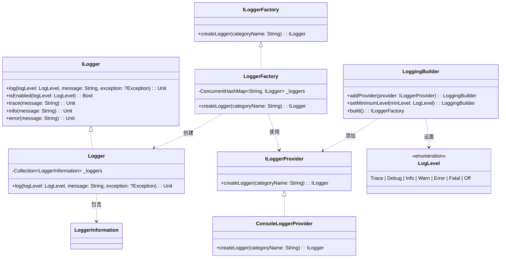
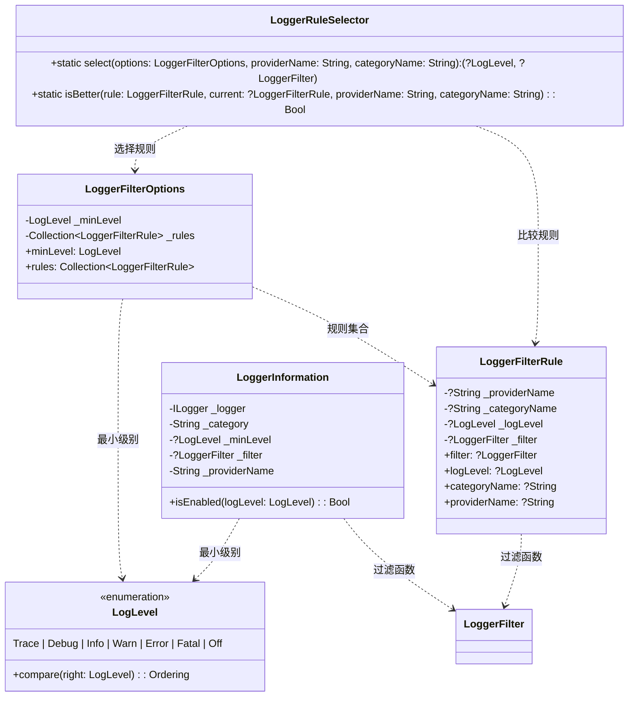

# spire_extensions_logging

日志记录（logging）组件，提供了模块化、可扩展的日志记录框架，支持 控制台、文件等多种日志存储方式，并可以自定义存储介质。

## 创建日志

``` cangjie
let logging = LoggingBuilder()
//添加控制台日志提供程序
logging.addConsole()
let loggerFactory = logging.build()
//1. 通过字符串的方式创建日志
let logger1 = loggerFactory.createLogger("test1")

//2. 通过类型完全限定名创建日志
let logger2 = loggerFactory.createLogger<Object>()
```

## 日志级别

``` cangjie
let logging = LoggingBuilder()
//设置日志的最低级别
logging.setMinimumLevel(LogLevel.Warn)

let logger = loggerFactory.createLogger("test1")
logger.info("hello cangjie!")//不打印

logger.error("hello cangjie!")//打印

```

## 日志过滤器

``` cangjie
let logging = LoggingBuilder()

//如果日志提供程序是console并且日志级别大于Warn才打印
logging.addFilter{providerName, categoryName, logLevel =>
    if (providerName == "console" && logLevel >= LogLevel.Warn) {
        return true
    }
    return false
}

logger.info("hello cangjie!")//不打印

logger.error("hello cangjie!")//打印
```

## 核心UML类图

```mermaid
classDiagram
    class ILogger {
        +log(logLevel: LogLevel, message: String, exception: ?Exception): Unit
        +isEnabled(logLevel: LogLevel): Bool
        +trace(message: String): Unit
        +debug(message: String): Unit
        +info(message: String): Unit
        +warn(message: String): Unit
        +error(message: String): Unit
        +error(exception: Exception, message: String): Unit
        +fatal(message: String): Unit
    }
    
    class Logger {
        -Collection~LoggerInformation~ _loggers
        +init(loggers: Collection~LoggerInformation~)
        +isEnabled(logLevel: LogLevel): Bool
        +log(logLevel: LogLevel, message: String, exception: ?Exception): Unit
    }
    
    class ConsoleLogger {
        -String _categoryName
        +init(categoryName: String)
        +log(logLevel: LogLevel, message: String, exception: ?Exception): Unit
        -coloredAnsi(logLevel: LogLevel): String
    }
    
    class ILoggerFactory {
        +createLogger~T~(): ILogger
        +createLogger(categoryName: String): ILogger
    }
    
    class LoggerFactory {
        -LoggerFilterOptions _options
        -ConcurrentHashMap~String, ILogger~ _loggers
        -Collection~ILoggerProvider~ _providers
        +init(providers: Collection~ILoggerProvider~, options: LoggerFilterOptions)
        +createLogger(categoryName: String): ILogger
        +createLoggers(categoryName: String): Collection~LoggerInformation~
        +static create(configure: (LoggingBuilder) -> Unit): ILoggerFactory
    }
    
    class ILoggerProvider {
        +name: String
        +createLogger(categoryName: String): ILogger
    }
    
    class ConsoleLoggerProvider {
        +name: String
        +createLogger(categoryName: String): ILogger
    }
    
    class LoggingBuilder {
        -LogLevel _minLevel
        -ArrayList~LoggerFilterRule~ _rules
        -HashMap~TypeInfo, ILoggerProvider~ _providers
        +addFilter(filter: LoggerFilter): LoggingBuilder
        +addFilter(providerName: ?String, categoryName: ?String, logLevel: LogLevel): LoggingBuilder
        +setMinimumLevel(minLevel: LogLevel): LoggingBuilder
        +addProvider(provider: ILoggerProvider): LoggingBuilder
        +clearProviders(): LoggingBuilder
        +build(): ILoggerFactory
    }
    
    class LogLevel {
        <<enumeration>>
        Trace | Debug | Info | Warn | Error | Fatal | Off
        +compare(right: LogLevel): Ordering
        +toString(): String
    }
    
    class LoggerFilterOptions {
        -LogLevel _minLevel
        -Collection~LoggerFilterRule~ _rules
        +init(minLogLevel: LogLevel, rules: Collection~LoggerFilterRule~)
        +minLevel: LogLevel
        +rules: Collection~LoggerFilterRule~
    }
    
    class LoggerFilterRule {
        -?String _providerName
        -?String _categoryName
        -?LogLevel _logLevel
        -?LoggerFilter _filter
        +init(providerName: ?String, categoryName: ?String, logLevel: LogLevel)
        +init(filter: ?LoggerFilter)
        +filter: ?LoggerFilter
        +logLevel: ?LogLevel
        +categoryName: ?String
        +providerName: ?String
        +toString(): String
    }
    
    class LoggerInformation {
        -ILogger _logger
        -String _category
        -?LogLevel _minLevel
        -?LoggerFilter _filter
        -String _providerName
        +init(logger: ILogger, category: String, providerName: String, minLevel: ?LogLevel, filter: ?LoggerFilter)
        +logger: ILogger
        +category: String
        +providerName: String
        +filter: ?LoggerFilter
        +minLevel: ?LogLevel
        +isEnabled(logLevel: LogLevel): Bool
    }
    
    class LoggerRuleSelector {
        -static Char _wildcardChar
        +static select(options: LoggerFilterOptions, providerName: String, categoryName: String): (?LogLevel, ?LoggerFilter)
        +static isBetter(rule: LoggerFilterRule, current: ?LoggerFilterRule, providerName: String, categoryName: String): Bool
    }
    
    class Exception {
        +message: String
        +printStackTrace(): Unit
    }
    
    class String {
    }
    
    class Bool {
    }
    
    class Unit {
    }
    
    class Collection~T~ {
    }
    
    class ArrayList~T~ {
    }
    
    class ConcurrentHashMap~K, V~ {
    }
    
    class HashMap~K, V~ {
    }
    
    class TypeInfo {
    }
    
    class Ordering {
        LT | EQ | GT
    }
    
    class ToString {
    }
    
    class Comparable~T~ {
    }
    
    %% 继承关系
    ILogger <|-- Logger
    ILogger <|-- ConsoleLogger
    ILoggerFactory <|-- LoggerFactory
    ILoggerProvider <|-- ConsoleLoggerProvider
    LogLevel <|-- Comparable~LogLevel~
    LogLevel <|-- ToString
    LoggerFilterRule <|-- ToString
    
    %% 实现关系
    Logger ..> ILogger : 实现
    ConsoleLogger ..> ILogger : 实现
    LoggerFactory ..> ILoggerFactory : 实现
    ConsoleLoggerProvider ..> ILoggerProvider : 实现
    
    %% 依赖关系
    Logger ..> LoggerInformation : 包含
    Logger ..> LogLevel : 日志级别
    Logger ..> Exception : 异常处理
    ConsoleLogger ..> String : 类别名称
    ConsoleLogger ..> LogLevel : 日志级别
    ConsoleLogger ..> Exception : 异常处理
    LoggerFactory ..> LoggerFilterOptions : 过滤选项
    LoggerFactory ..> ConcurrentHashMap~String, ILogger~ : 日志器缓存
    LoggerFactory ..> LoggerInformation : 日志信息
    LoggerFactory ..> LoggerRuleSelector : 规则选择器
    ConsoleLoggerProvider ..> ConsoleLogger : 创建
    LoggingBuilder ..> LogLevel : 最小级别
    LoggingBuilder ..> LoggerFilterRule : 过滤规则
    LoggingBuilder ..> HashMap~TypeInfo, ILoggerProvider~ : 提供者映射
    LoggingBuilder ..> LoggerFactory : 创建工厂
    LoggingBuilder ..> LoggerFilterOptions : 创建选项
    LoggerFilterOptions ..> LogLevel : 最小级别
    LoggerFilterOptions ..> LoggerFilterRule : 过滤规则
    LoggerFilterRule ..> LoggerFilter : 过滤函数
    LoggerFilterRule ..> String : 提供者和类别名称
    LoggerFilterRule ..> LogLevel : 日志级别
    LoggerInformation ..> ILogger : 具体日志器
    LoggerInformation ..> String : 类别和提供者名称
    LoggerInformation ..> LogLevel : 最小级别
    LoggerInformation ..> LoggerFilter : 过滤函数
    LoggerRuleSelector ..> LoggerFilterOptions : 过滤选项
    LoggerRuleSelector ..> LoggerFilterRule : 过滤规则
    LoggerRuleSelector ..> String : 通配符匹配
    LoggerRuleSelector ..> Exception : 异常处理
    
    %% 扩展关系
    LoggingBuilder ..> ConsoleLoggerProvider : 添加提供者
```



## 精简版UML类图



## 过滤系统UML类图



## 类型别名说明

**LoggerFilter** 是一个类型别名，定义为：
```cangjie
type LoggerFilter = (providerName: String, categoryName: String, level: LogLevel) -> Bool
```

用于自定义日志过滤逻辑，在 LoggerFilterRule 和 LoggerInformation 中使用。

## 设计特点

1. **多提供者支持**: 支持同时使用多个日志提供者，实现日志的多元化输出
2. **灵活过滤**: 提供基于级别、类别、提供者的多层次过滤机制
3. **缓存机制**: LoggerFactory 使用并发缓存，提高日志器创建性能
4. **构建器模式**: LoggingBuilder 提供流畅的配置 API
5. **类型安全**: 使用泛型和强类型确保类型安全
6. **线程安全**: 关键组件使用并发集合，支持多线程环境
7. **扩展性**: 通过 ILoggerProvider 接口支持自定义日志输出
8. **彩色输出**: 控制台日志器支持彩色输出，提高日志可读性

## 使用场景

- 应用程序日志记录
- 调试和开发环境
- 生产环境监控
- 多模块日志管理
- 分布式系统日志
- 性能监控和诊断
- 错误跟踪和报告

## 核心类关系说明

**核心接口**：
- **ILogger**: 日志记录接口
- **ILoggerFactory**: 日志工厂接口
- **ILoggerProvider**: 日志提供者接口

**核心实现**：
- **Logger**: 组合日志器
- **LoggerFactory**: 日志工厂
- **ConsoleLogger**: 控制台日志器
- **ConsoleLoggerProvider**: 控制台日志提供者

**配置和构建**：
- **LoggingBuilder**: 日志构建器
- **LoggerFilterOptions**: 过滤选项
- **LoggerFilterRule**: 过滤规则

**过滤系统**：
- **LoggerInformation**: 日志信息
- **LoggerRuleSelector**: 规则选择器
- **LoggerFilter**: 过滤函数类型

**枚举类型**：
- **LogLevel**: 日志级别枚举