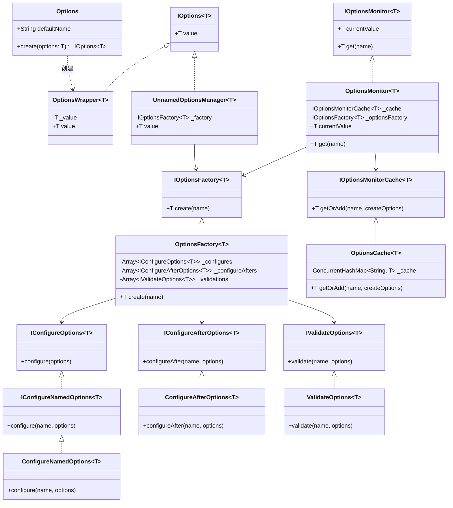
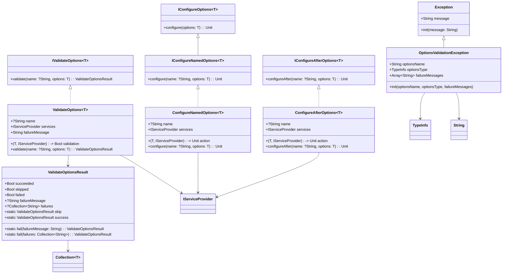

# spire_extensions_options
选项配置（Options）库。它提供了统一的、类型安全的、规范的方式来配置应用程序，并且支持多架构多租户。它是对依赖注入的扩展和补充。

## 基础使用

``` cangjie
public class ApplicationOptions {
   var name = ""
}

let services = ServiceCollection()

services.configureAfter<ApplicationOptions>({configureOptions => 
    configureOptions.name = "cangjie"
})

services.configure<ApplicationOptions>({configureOptions => 
    configureOptions.name = "spire"
})

//构建容器
let provider = services.build()

//解析选项
let options = provider.getOrThrow<IOptions<ApplicationOptions>>()

//打印选项
options.value.name |> println //cangjie
```

> `configureAfter`配置函数在所有的`configure`函数运行结束之后执行。

## 命名选项


``` cangjie

let services = ServiceCollection()

services.configure<ApplicationOptions>({configureOptions => 
    configureOptions.name = "default"
})

services.configure<ApplicationOptions>("tenant1", {configureOptions => 
    configureOptions.name = "tenant1"
})

services.configure<ApplicationOptions>("tenant2", {configureOptions => 
    configureOptions.name = "tenant2"
})

//构建容器
let provider = services.build()

//解析选项
let optionsMonitor = provider.getOrThrow<IOptionsMonitor<ApplicationOptions>>()

//打印租户1的选项
optionsMonitor.currentValue.name |> println //default

//打印租户1的选项
optionsMonitor.get("tenant1").name |> println //tenant1

//打印租户2的选项
optionsMonitor.get("tenant1").name |> println //tenant1
```

## UML类图

```mermaid
classDiagram
    class IOptions~TOptions~ {
        +TOptions value
    }
    
    class Options {
        +String defaultName
        +create(options: TOptions): IOptions~TOptions~
    }
    
    class OptionsWrapper~TOptions~ {
        -TOptions _value
        +TOptions value
        +init(options: TOptions)
    }
    
    class UnnamedOptionsManager~TOptions~ {
        -?TOptions _options
        -IOptionsFactory~TOptions~ _factory
        -AtomicOptionReference~Mutex~ _lock
        +init(factory: IOptionsFactory~TOptions~)
        +TOptions value
    }
    
    class IOptionsFactory~TOptions~ {
        +create(name: String): TOptions
    }
    
    class OptionsFactory~TOptions~ {
        -Array~IConfigureOptions~TOptions~~ _configures
        -Array~IValidateOptions~TOptions~~ _validations
        -Array~IConfigureAfterOptions~TOptions~~ _configureAfters
        +init(configures, configureAfters, validations)
        +create(name: String): TOptions
        -createInstance(): TOptions
    }
    
    class IOptionsMonitor~TOptions~ {
        +TOptions currentValue
        +get(name: String): TOptions
    }
    
    class OptionsMonitor~TOptions~ {
        -IOptionsMonitorCache~TOptions~ _cache
        -IOptionsFactory~TOptions~ _optionsFactory
        +init(cache, optionsFactory)
        +get(name: String): TOptions
        +TOptions currentValue
    }
    
    class IOptionsMonitorCache~TOptions~ {
        +getOrAdd(name: String, createOptions: () -> TOptions): TOptions
    }
    
    class OptionsCache~TOptions~ {
        -ConcurrentHashMap~String, TOptions~ _cache
        +getOrAdd(name: String, createOptions: () -> TOptions): TOptions
        +add(name: String, options: TOptions): ?TOptions
        +remove(name: String): ?TOptions
    }
    
    class IConfigureOptions~TOptions~ {
        +configure(options: TOptions): Unit
    }
    
    class IConfigureNamedOptions~TOptions~ {
        +configure(name: ?String, options: TOptions): Unit
    }
    
    class ConfigureNamedOptions~TOptions~ {
        +?String name
        +IServiceProvider services
        +(TOptions, IServiceProvider) -> Unit action
        +init(name, services, action)
        +configure(options: TOptions): Unit
        +configure(name: ?String, options: TOptions): Unit
    }
    
    class IConfigureAfterOptions~TOptions~ {
        +configureAfter(name: ?String, options: TOptions): Unit
    }
    
    class ConfigureAfterOptions~TOptions~ {
        +?String name
        +IServiceProvider services
        +(TOptions, IServiceProvider) -> Unit action
        +init(name, services, action)
        +configureAfter(name: ?String, options: TOptions): Unit
    }
    
    class IValidateOptions~TOptions~ {
        +validate(name: ?String, options: TOptions): ValidateOptionsResult
    }
    
    class ValidateOptions~TOptions~ {
        +?String name
        +IServiceProvider services
        +(TOptions, IServiceProvider) -> Bool validation
        +String failureMessage
        +init(name, services, validation, failureMessage)
        +validate(name: ?String, options: TOptions): ValidateOptionsResult
    }
    
    class ValidateOptionsResult {
        +Bool succeeded
        +Bool skipped
        +Bool failed
        +?String failureMessage
        +?Collection~String~ failures
        +static ValidateOptionsResult skip
        +static ValidateOptionsResult success
        +static fail(failureMessage: String): ValidateOptionsResult
        +static fail(failures: Collection~String~): ValidateOptionsResult
    }
    
    class OptionsValidationException {
        +String optionsName
        +TypeInfo optionsType
        +Array~String~ failureMessages
        +init(optionsName, optionsType, failureMessages)
    }
    
    class OptionsBuilder~TOptions~ {
        +String name
        +ServiceCollection services
        +init(name, services)
        +configure(configureOptions: (TOptions) -> Unit): OptionsBuilder~TOptions~
        +configure(configureOptions: (TOptions, IServiceProvider) -> Unit): OptionsBuilder~TOptions~
        +configureAfter(configureOptions: (TOptions) -> Unit): OptionsBuilder~TOptions~
        +configureAfter(configureOptions: (TOptions, IServiceProvider) -> Unit): OptionsBuilder~TOptions~
        +validate(validation: (TOptions) -> Bool): OptionsBuilder~TOptions~
        +validate(validation: (TOptions, IServiceProvider) -> Bool): OptionsBuilder~TOptions~
    }
    
    class OptionsServiceCollectionExtensions {
        +addOptions~TOptions~(): OptionsBuilder~TOptions~
        +addOptions~TOptions~(name: String): OptionsBuilder~TOptions~
        +configure~TOptions~(configureOptions: (TOptions) -> Unit): ServiceCollection
        +configure~TOptions~(name: String, configureOptions: (TOptions) -> Unit): ServiceCollection
        +configure~TOptions~(configureOptions: (TOptions, IServiceProvider) -> Unit): ServiceCollection
        +configure~TOptions~(name: String, configureOptions: (TOptions, IServiceProvider) -> Unit): ServiceCollection
        +configureAfter~TOptions~(configureOptions: (TOptions) -> Unit): ServiceCollection
        +configureAfter~TOptions~(name: String, configureOptions: (TOptions) -> Unit): ServiceCollection
        +configureAfter~TOptions~(configureOptions: (TOptions, IServiceProvider) -> Unit): ServiceCollection
        +configureAfter~TOptions~(name: String, configureOptions: (TOptions, IServiceProvider) -> Unit): ServiceCollection
        +configureAll~TOptions~(configureOptions: (TOptions) -> Unit): ServiceCollection
        +configureAll~TOptions~(configureOptions: (TOptions, IServiceProvider) -> Unit): ServiceCollection
        +configureAfterAll~TOptions~(configureOptions: (TOptions) -> Unit): ServiceCollection
        +configureAfterAll~TOptions~(configureOptions: (TOptions, IServiceProvider) -> Unit): ServiceCollection
    }
    
    class ServiceCollection {
    }
    
    class IServiceProvider {
    }
    
    class Exception {
    }
    
    class TypeInfo {
    }
    
    class ConcurrentHashMap~K, V~ {
    }
    
    class Mutex {
    }
    
    class AtomicOptionReference~T~ {
    }
    
    class Array~T~ {
    }
    
    class Collection~T~ {
    }
    
    class String {
    }
    
    class Bool {
    }
    
    class Unit {
    }
    
    class Object {
    }
    
    %% 继承关系
    IOptions~TOptions~ <|-- OptionsWrapper~TOptions~
    IOptions~TOptions~ <|-- UnnamedOptionsManager~TOptions~
    IOptionsFactory~TOptions~ <|-- OptionsFactory~TOptions~
    IOptionsMonitor~TOptions~ <|-- OptionsMonitor~TOptions~
    IOptionsMonitorCache~TOptions~ <|-- OptionsCache~TOptions~
    IConfigureOptions~TOptions~ <|-- IConfigureNamedOptions~TOptions~
    IConfigureOptions~TOptions~ <|-- ConfigureNamedOptions~TOptions~
    IConfigureNamedOptions~TOptions~ <|-- ConfigureNamedOptions~TOptions~
    IConfigureAfterOptions~TOptions~ <|-- ConfigureAfterOptions~TOptions~
    IValidateOptions~TOptions~ <|-- ValidateOptions~TOptions~
    Exception <|-- OptionsValidationException
    
    %% 依赖关系
    Options ..> OptionsWrapper~TOptions~ : 创建
    OptionsFactory~TOptions~ ..> IConfigureOptions~TOptions~ : 依赖
    OptionsFactory~TOptions~ ..> IConfigureAfterOptions~TOptions~ : 依赖
    OptionsFactory~TOptions~ ..> IValidateOptions~TOptions~ : 依赖
    OptionsFactory~TOptions~ ..> OptionsValidationException : 抛出
    OptionsMonitor~TOptions~ ..> IOptionsMonitorCache~TOptions~ : 依赖
    OptionsMonitor~TOptions~ ..> IOptionsFactory~TOptions~ : 依赖
    UnnamedOptionsManager~TOptions~ ..> IOptionsFactory~TOptions~ : 依赖
    UnnamedOptionsManager~TOptions~ ..> Mutex : 线程安全
    OptionsCache~TOptions~ ..> ConcurrentHashMap~String, TOptions~ : 底层存储
    ConfigureNamedOptions~TOptions~ ..> IServiceProvider : 依赖
    ConfigureNamedOptions~TOptions~ ..> String : 名称比较
    ConfigureAfterOptions~TOptions~ ..> IServiceProvider : 依赖
    ConfigureAfterOptions~TOptions~ ..> String : 名称比较
    ValidateOptions~TOptions~ ..> IServiceProvider : 依赖
    ValidateOptions~TOptions~ ..> String : 名称比较
    ValidateOptionsResult ..> Collection~String~ : 失败消息集合
    OptionsBuilder~TOptions~ ..> ServiceCollection : 服务集合
    OptionsBuilder~TOptions~ ..> String : 选项名称
    OptionsServiceCollectionExtensions ..> ServiceCollection : 扩展
    OptionsServiceCollectionExtensions ..> OptionsBuilder~TOptions~ : 创建
    OptionsServiceCollectionExtensions ..> ConfigureNamedOptions~TOptions~ : 注册
    OptionsServiceCollectionExtensions ..> ConfigureAfterOptions~TOptions~ : 注册
    OptionsServiceCollectionExtensions ..> ValidateOptions~TOptions~ : 注册
    OptionsServiceCollectionExtensions ..> UnnamedOptionsManager~TOptions~ : 注册
    OptionsServiceCollectionExtensions ..> OptionsMonitor~TOptions~ : 注册
    OptionsServiceCollectionExtensions ..> OptionsFactory~TOptions~ : 注册
    OptionsServiceCollectionExtensions ..> OptionsCache~TOptions~ : 注册
    OptionsValidationException ..> String : 错误消息
    OptionsValidationException ..> TypeInfo : 类型信息
    
    %% 泛型约束
    IOptions~TOptions~ ..> Object : TOptions约束
    OptionsWrapper~TOptions~ ..> Object : TOptions约束
    UnnamedOptionsManager~TOptions~ ..> Object : TOptions约束
    IOptionsFactory~TOptions~ ..> Object : TOptions约束
    OptionsFactory~TOptions~ ..> Object : TOptions约束
    IOptionsMonitor~TOptions~ ..> Object : TOptions约束
    OptionsMonitor~TOptions~ ..> Object : TOptions约束
    IOptionsMonitorCache~TOptions~ ..> Object : TOptions约束
    OptionsCache~TOptions~ ..> Object : TOptions约束
    IConfigureOptions~TOptions~ ..> Object : TOptions约束
    IConfigureNamedOptions~TOptions~ ..> Object : TOptions约束
    ConfigureNamedOptions~TOptions~ ..> Object : TOptions约束
    IConfigureAfterOptions~TOptions~ ..> Object : TOptions约束
    ConfigureAfterOptions~TOptions~ ..> Object : TOptions约束
    IValidateOptions~TOptions~ ..> Object : TOptions约束
    ValidateOptions~TOptions~ ..> Object : TOptions约束
    OptionsBuilder~TOptions~ ..> Object : TOptions约束
```



## 核心组件说明

### 1. 接口层
- **IOptions<TOptions>**: 基础选项接口，提供访问选项值的属性
- **IOptionsFactory<TOptions>**: 选项工厂接口，负责创建选项实例
- **IOptionsMonitor<TOptions>**: 选项监视器接口，支持动态获取选项值
- **IOptionsMonitorCache<TOptions>**: 选项缓存接口，提供选项值的缓存管理
- **IConfigureOptions<TOptions>**: 选项配置接口，定义选项配置行为
- **IConfigureNamedOptions<TOptions>**: 命名选项配置接口，支持命名配置
- **IConfigureAfterOptions<TOptions>**: 后配置接口，在基础配置后执行
- **IValidateOptions<TOptions>**: 选项验证接口，定义选项验证逻辑

### 2. 实现层
- **Options**: 静态工具类，提供默认名称和创建方法
- **OptionsWrapper<TOptions>**: 选项包装器，简单的选项实现
- **UnnamedOptionsManager<TOptions>**: 未命名选项管理器，支持延迟初始化和线程安全
- **OptionsFactory<TOptions>**: 选项工厂实现，支持配置、后配置和验证
- **OptionsMonitor<TOptions>**: 选项监视器实现，支持动态获取和缓存
- **OptionsCache<TOptions>**: 选项缓存实现，基于并发哈希表
- **ConfigureNamedOptions<TOptions>**: 命名选项配置实现
- **ConfigureAfterOptions<TOptions>**: 后配置实现
- **ValidateOptions<TOptions>**: 选项验证实现
- **ValidateOptionsResult**: 验证结果类，表示验证状态

### 3. 扩展层
- **OptionsBuilder<TOptions>**: 选项构建器，提供流畅的API配置选项
- **OptionsServiceCollectionExtensions**: 服务集合扩展，提供依赖注入集成

### 4. 异常处理
- **OptionsValidationException**: 选项验证异常，包含验证失败信息

## 设计特点

1. **泛型设计**: 所有核心组件都支持泛型，提供类型安全
2. **接口分离**: 通过多个接口定义不同职责，遵循接口分离原则
3. **依赖注入**: 与依赖注入容器深度集成，支持服务生命周期管理
4. **线程安全**: 关键组件实现线程安全，支持并发访问
5. **缓存机制**: 内置缓存机制，提高性能
6. **验证系统**: 完整的验证框架，支持自定义验证逻辑
7. **配置链**: 支持配置、后配置的链式处理
8. **命名支持**: 支持命名选项，实现选项隔离

## 使用场景

- 应用程序配置管理
- 模块化配置
- 动态配置更新
- 配置验证和错误处理
- 依赖注入集成
- 多环境配置支持

## 精简版UML类图



## 验证和异常处理UML类图



### 验证和异常处理核心类说明

**验证相关**：
- **IValidateOptions<T>**: 验证接口，定义验证行为
- **ValidateOptions<T>**: 验证实现，支持命名验证和服务依赖
- **ValidateOptionsResult**: 验证结果，包含成功/失败状态和失败消息

**异常处理**：
- **OptionsValidationException**: 验证异常，包含选项名称、类型和失败消息

**配置验证**：
- **ConfigureNamedOptions<T>**: 命名配置，支持配置时验证
- **ConfigureAfterOptions<T>**: 后配置，支持配置后验证

### 精简版核心类说明

**核心接口**：
- **IOptions<TOptions>**: 基础选项接口
- **IOptionsFactory<TOptions>**: 选项工厂接口  
- **IOptionsMonitor<TOptions>**: 选项监视器接口
- **IConfigureOptions<TOptions>**: 选项配置接口
- **IValidateOptions<TOptions>**: 选项验证接口

**核心实现**：
- **Options**: 静态工具类
- **OptionsWrapper<TOptions>**: 简单选项实现
- **UnnamedOptionsManager<TOptions>**: 选项管理器
- **OptionsFactory<TOptions>**: 选项工厂
- **OptionsMonitor<TOptions>**: 选项监视器
- **ValidateOptionsResult**: 验证结果

**扩展组件**：
- **OptionsBuilder<TOptions>**: 选项构建器
- **OptionsServiceCollectionExtensions**: 依赖注入扩展