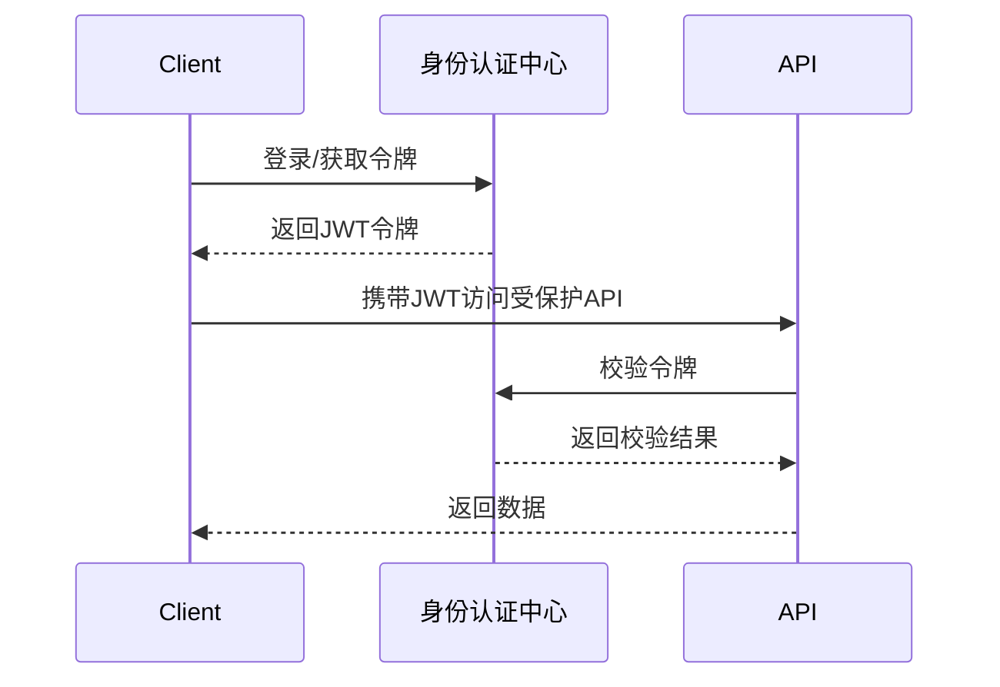

# 身份认证中心（Identity Server）

身份认证中心是统一管理用户身份、签发和验证令牌的服务组件。它通常作为微服务架构中的独立服务，负责用户登录、令牌颁发、令牌校验等。

---

## 1. 主要功能
- 用户注册、登录、登出
- 颁发 JWT 等身份令牌
- 校验令牌有效性
- 支持多种认证协议（如 OIDC、OAuth2）
- 集成第三方身份提供商

---

## 2. 典型架构

---

## 3. Spire 集成示例

- 使用 OIDC/JWT Bearer 认证中间件对接认证中心
- 服务端通过 `JwtSecurityTokenHandler` 验证令牌
- 可结合授权中间件实现细粒度权限控制

---

## 4. 最佳实践
- 认证中心建议独立部署，保证高可用
- 令牌签名密钥应安全存储
- 令牌过期时间不宜过长
- 建议全链路 HTTPS

---

身份认证中心是现代分布式系统安全的基石，合理设计和集成可大幅提升系统安全性和用户体验。
