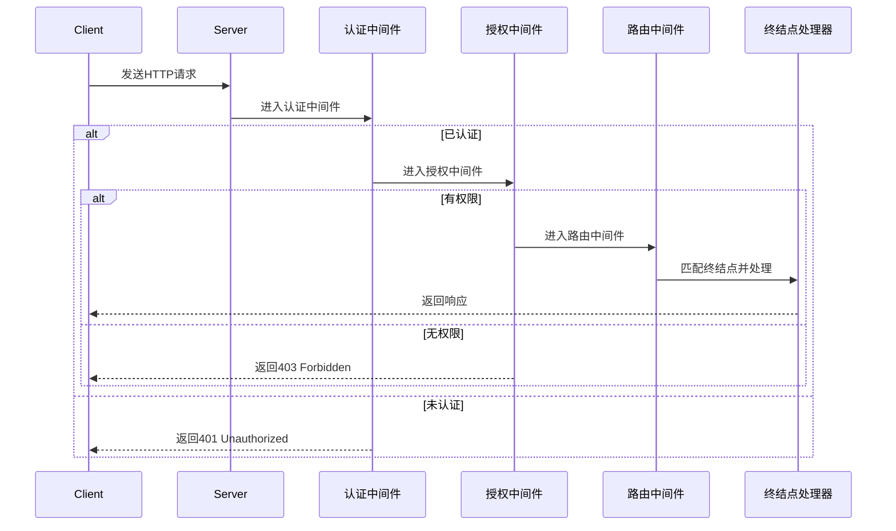

# 身份认证中间件

身份认证中间件用于识别用户身份，保护API和页面资源，是安全开发的基础。

## 一、核心作用

- 验证用户身份，防止未授权访问。
- 支持多种认证方式（Cookie、JWT、OIDC等）。
- 可扩展第三方登录、单点登录等高级场景。

## 二、快速启动

只需 4 步即可集成认证服务：

```cangjie
import spire_web_hosting.*
import spire_web_http.*
import spire_web_authentication.*

main() {
    // 1. 构建Web主机
    let builder = WebHost.createBuilder()
    // 2. 注册认证服务
    builder.services.addAuthentication()
    let host = builder.build()

    // 3. 启用认证中间件
    host.useAuthentication()
    // 4. 启动主机
    host.run()
}
```

:::tip 添加依赖
需要在依赖配置文件(cjpm.toml)中添加如下依赖：

```bash
[dependencies]
  spire_web_http = { path = "/spire_web_http"}
  spire_web_hosting = { path = "/spire_web_hosting"}
  spire_web_authentication = { path = "/spire_web_authentication"}
  spire_extensions_injection = { path = "/spire_extensions_injection"}
```
:::

## 三、认证方案扩展

支持多种认证方式（如Cookie、JWT、OIDC等）：

```cangjie
builder.services.addAuthentication().addJwtBearer("jwt", options => {
    options.authority = "https://demo.identity"
    options.audience = "api"
})
```

## 四、认证流程说明

- 认证中间件会自动解析请求头、Cookie等，识别用户身份。
- 认证失败时可返回401 Unauthorized。
- 可结合授权中间件实现细粒度访问控制。

## 五、常见问题与建议

- 认证中间件应在授权、路由等中间件之前注册。
- 生产环境务必启用HTTPS，防止凭据泄露。
- 认证失败应返回明确的错误信息，便于前端处理。
- 可结合第三方登录、单点登录等扩展认证能力。

## 六、最佳实践

- 推荐JWT用于API，Cookie用于Web页面。
- 认证信息建议短时有效，降低风险。
- 认证相关配置（密钥、地址等）应安全存储。

## 七、请求管道与中间件流程图

下面以典型的中间件管道为例，展示请求从进入到响应的完整流程：



> [!TIP] 说明
> - 认证中间件负责识别用户身份。
> - 授权中间件负责校验权限。
> - 路由中间件负责分发到具体终结点。
> - 每个中间件只关注单一职责，顺序不可随意调整。

---

通过集成认证中间件，可有效保护API和页面资源安全。
